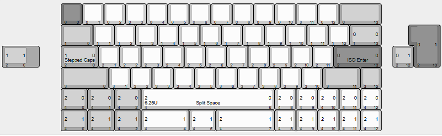
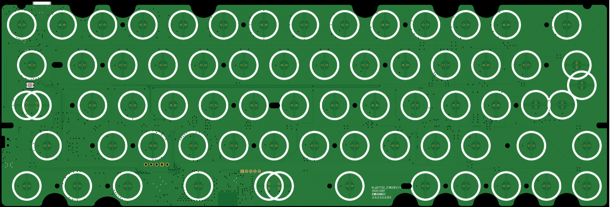
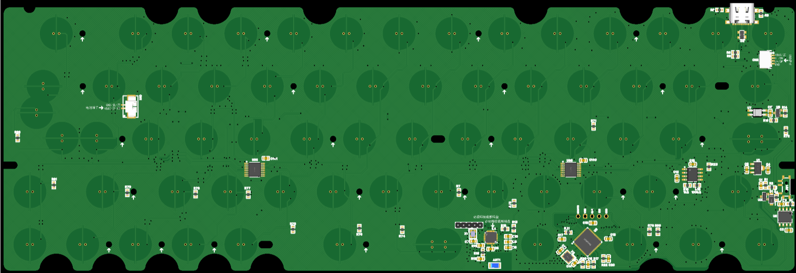
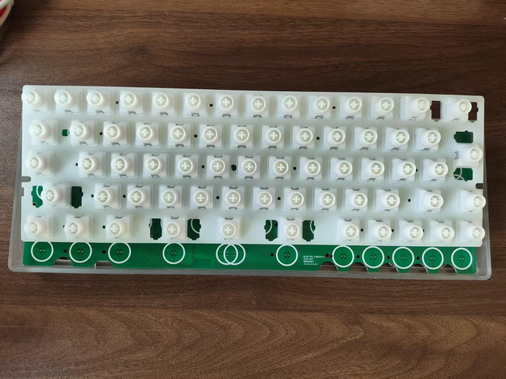

# EC60

Open source 60% Wireless Electrostatic Capacitive PCB.

## PCB JLC EDA
https://oshwhub.com/mjl_xpy/qmk-shuang-mo-qmk-san-mo-qmk-jian-pan-hl6075ec_stm32f411

## Firmware

[qmk_firmware_wireless/keyboards/keymagichorse/hl6077_ec_cip at e7cb7a8c157a271235d5c8c67700389413e49d98 · LinKeyDream/qmk_firmware_wireless](https://github.com/LinKeyDream/qmk_firmware_wireless/tree/e7cb7a8c157a271235d5c8c67700389413e49d98/keyboards/keymagichorse/hl6077_ec_cip)

## Introduction

## Technical information
- Layout size: 60% (GH60 outline and mounting points, see pictures below)
- Support for wireless three-mode
- Compatible switches: EC switches (Topre and NIZ)
- Microcontroller: STM32F401 + CH582F
- Connector:
    * USB-C
- Firmware compatibility: QMK (with VIA/VIAL support and wireless)
- Protection hardware (on all connection methods):
  * ESD protection

